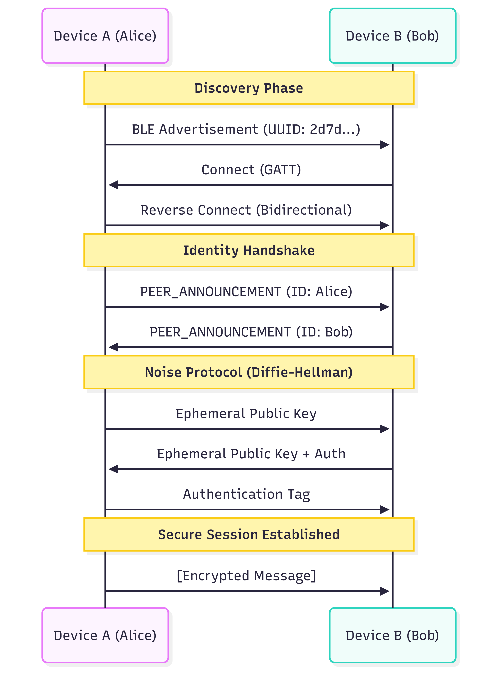
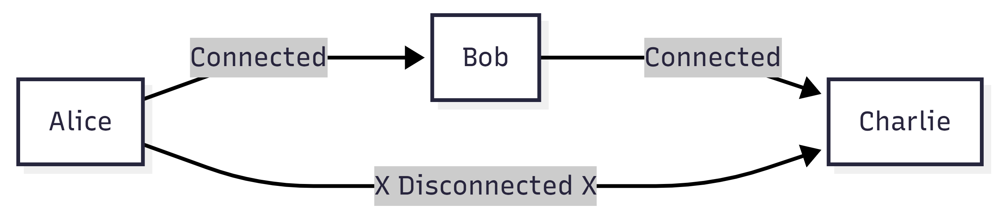

# OffGriid Project Documentation

This document provides a comprehensive, deep-dive explanation of the OffGriid project, covering its architecture, security protocols, internal mechanics, and user workflows.

---

## 1. Introduction

OffGriid is a decentralized, offline-first messaging application designed for Android devices. Unlike traditional messaging apps (WhatsApp, Telegram) that require the internet (Wi-Fi or Mobile Data) and central servers to route messages, OffGriid operates entirely on a local peer-to-peer (P2P) network using Bluetooth Low Energy (BLE).

### Layman Explanation
Imagine a classroom where students pass notes directly to each other instead of handing them to a teacher to distribute. If Student A wants to pass a note to Student C but they are too far apart, Student B sits in the middle and passes it along. OffGriid works the same way: mobile phones "talk" directly to each other without needing a cell tower or the internet.

---

## 2. Problem Statement

Modern communication infrastructure is fragile and centralized:
*   **Single Point of Failure**: If central servers go down, everyone loses connection.
*   **Censorship & Surveillance**: Internet Service Providers (ISPs) and governments can track metadata (who is talking to whom) or block access entirely.
*   **Infrastructure Dependence**: In natural disasters (hurricanes, earthquakes), cellular towers often fail, leaving victims isolated.

---

## 3. Use Cases

*   **Disaster Relief**: Communication for rescue teams and survivors in areas with destroyed infrastructure.
*   **Remote Exploration**: Hiking, camping, or maritime convoys beyond cell tower range.
*   **Privacy-Critical Communication**: Situations requiring absolute zero-knowledge metadata protection.
*   **Crowded Events**: Communication at festivals or protests where cell towers are overloaded/jammed.

---

## 4. The Solution

OffGriid creates a "Mesh Network" using the Bluetooth radios already present in smartphones.
*   **Decentralized**: No server. You own your identity and data.
*   **Offline**: Works locally.
*   **Secure**: End-to-end encrypted by default.

---

## 5. Technology Stack

*   **Language**: Kotlin (Native Android Development).
*   **UI Framework**: Jetpack Compose (Modern declarative UI).
*   **Architecture**: MVVM (Model-View-ViewModel) + Clean Architecture principles.
*   **Local Database**: Room (SQLite) for storing messages and peer details offline.
*   **Networking**: Android Bluetooth Low Energy (BLE) API.
*   **Cryptography Libraries**:
    *   **Bouncy Castle**: For low-level cryptographic primitives (hashing, signing).
    *   **Noise Protocol Framework**: For secure key exchange and encryption.

### Client-Server duality
One unique aspect of OffGriid is that **every device acts as BOTH a Client and a Server simultaneously**.
*   **As a Server**: Your phone advertises its presence and accepts incoming connections.
*   **As a Client**: Your phone scans for others and initiates connections.
This allows for true, decentralized mesh networking where all nodes are equal.


---

## 6. Identity System (The Core)

In OffGriid, there are no usernames, emails, or phone numbers. Your identity is cryptographic.

### How Identity is Generated
1.  **Ed25519 Algorithm**: When the app launches for the first time, it uses the Ed25519 Elliptic Curve algorithm to generate a "Key Pair":
    *   **Private Key**: A secret key kept securely on your device (in Encrypted Shared Preferences). NEVER shared.
    *   **Public Key**: A key shared with the world.

### Fingerprint (User ID)
The app takes your Public Key and passes it through a **SHA-256** hash function to create a unique **User ID**. This is your address in the network.

**Example User ID (What it looks like):**
```
a1b2c3d4e5f60718293a4b5c6d7e8f90... (64 characters)
```

---

## 7. Device Discovery (How Phones Find Each Other)

OffGriid ensures your device only talks to other OffGriid users, ignoring random Bluetooth devices (like headphones or fitbits). This happens in two stages:

### Step 1: Solving "Is this an OffGriid App?" (Scanning)
Before connecting, the phone needs to know if the nearby device is running the OffGriid application. It does this without knowing *who* the user is yet.

1.  **Service UUID**: Every OffGriid device broadcasts a specific 128-bit unique ID. It looks exactly like this:
    ```
    2d7d3d8a-8e2b-4d7a-9c6f-5b4e3d2c1a0f
    ```
    **Note**: Every single OffGriid device in the world uses this **EXACT SAME UUID**. This acts like a "Radio Frequency" that all our apps tune into. It tells the phone "I speak OffGriid language".

2.  **Magic Bytes**: To be extra sure, devices also broadcast specific bytes in the Manufacturer Data field:
    *   **'O'** (`0x4F`)
    *   **'G'** (`0x47`)

**Result**: If your phone sees a signal with this UUID and these Magic Bytes, it knows "That device is running OffGriid software."

### Step 2: Solving "Who is this User?" (Post-Connection)
The User ID (SHA-256 hash) is **NOT** validated during the scanning phase. It happens **after** the devices connect.

1.  **Connect**: The phones establish a Bluetooth GATT connection.
2.  **Exchange**: They swap their Public Keys.
3.  **Verify**: Each phone calculates the SHA-256 hash of the received Public Key. If it matches the format of a valid ID, the user appears in your list.

---

## 8. Transport Encryption & Security

Once two devices find each other, they must secure the connection so no one nearby can "sniff" the conversation.

### The Algorithm: Noise Protocol Framework
We use a variant called `Noise_XX_25519_ChaChaPoly_BLAKE2b`.
*   **Key Exchange (X25519)**: Used to derive shared secrets (The "Math Puzzle").
*   **Encryption (ChaCha20-Poly1305)**: This is an **AEAD** cipher (Authenticated Encryption with Associated Data). We use it to **encrypt the actual messages** (payloads). It ensures confidentiality (no one can read it) and integrity (no one tampered with it).
*   **Hashing (BLAKE2b)**: This is a secure hash function. We use it internally during the Handshake to **mix keys** and derive the final session keys. It ensures that the keys generated are mathematically linked to the handshake steps.


### The Diffie-Hellman Sequence (Layman Terms: The Math Puzzle)
Imagine Alice and Bob want to agree on a secret number without whispering.

1.  **Public Number**: They agree on a generic number, say **7**. Everyone sees this.
2.  **Private Calculation**:
    *   Alice picks a Secret Number (**3**). She combines it with 7 to get **21**. She shouts "21!"
    *   Bob picks a Secret Number (**6**). He combines it with 7 to get **42**. He shouts "42!"
3.  **The Magic**:
    *   Alice takes Bob's "42" and updates it with her Secret (3). Result: **126**.
    *   Bob takes Alice's "21" and updates it with his Secret (6). Result: **126**.
4.  **Result**: They both now have the **Shared Secret (126)**.
    *   An eavesdropper heard "7", "21", and "42".
    *   However, due to the complex "Modular Arithmetic" used in real crypto, the eavesdropper cannot calculate "126" without knowing the secret 3 or 6.




---

## 9. User Workflow & App Structure

### 1. Onboarding
*   **Welcome Screen**: Introduction.
*   **Permissions**: The user MUST grant "Nearby Devices" (Bluetooth) and "Location" permissions. Without these, Android forbids the app from using the radio.
*   **Profile**: User sets a "Nickname". This is just a local display name; the cryptographic ID is the real identifier.

### 2. Home Screen (Discovery)
*   The app immediately starts Advertising and Scanning in the background.
*   Nearby peers appear in a list.
*   **Status**: Indicates if a peer is "Connected" or "Last Seen X min ago".

### 3. Messaging
*   User taps a Peer.
*   Enters Chat Screen.
*   Messages are encrypted, sent over BLE, stored locally in Room Database, and displayed.

---

## 10. MITM Mitigation (QR Code Verification)

**The Attack**: A customized attacker ("Mallory") sits between Alice and Bob. Mallory pretends to be Bob to Alice, and Alice to Bob.
**The Solution**: Out-of-Band Verification via QR Code.

1.  **Show QR**: Alice displays a QR code containing her Public Key Fingerprint.
2.  **Scan QR**: Bob scans this code with his camera.
3.  **Comparision**: Bob's app compares the Scanned Fingerprint with the Fingerprint of the currently connected Bluetooth session.
    *   **Match**: "Verification Successful". The app marks Alice as Verified (Green Badge).
    *   **No Match**: "SECURITY WARNING". Someone is intercepting the connection!

---

## 11. Network Expansion (Mesh)

While the current implementation focuses on direct P2P, the architecture supports "Store-and-Forward" routing.



If Alice sends a message to Charlie:
1.  Alice checks her direct connections. Charlie is missing.
2.  Alice wraps the message in a "Packet" with `Recipient: Charlie` and `TTL: 5` (Time To Live).
3.  Alice sends it to Bob.
4.  Bob receives it. "Is this for me? No."
5.  Bob decreases TTL to 4.
6.  Bob rebroadcasts it to HIS connections (Charlie).
7.  Charlie receives it. "Is this for me? Yes!" -> Decrypts and Reads.

---

## 12. Application Features

*   **Secure Text Messaging**: The core feature. Low latency, encrypted.
*   **Voice Notes**: Uses `VoiceRecorder` to capture audio, compresses it using AAC (Advanced Audio Coding) to minimize file size (crucial for slow Bluetooth bandwidth), and transmits it in chunks.
*   **Image Sharing**: Converts images to compressed Bitmaps/ByteArrays for transmission.
*   **Favorites**: Users can "Pin" frequently contacted peers to the top of their list.
*   **Personalization**: Users can rename peers locally (e.g., rename "Xy9z..." to "Dad").

---

## 13. Summary of Security Techniques

1.  **Zero-Knowledge Architecture**: Server knows nothing because there is no server.
2.  **Forward Secrecy**: Stolen keys cannot decrypt past conversations.
3.  **Local Storage Encryption**: Sensitive keys in SharedPreferences are encrypted using the Android Keystore System.
4.  **No Internet**: Physical isolation from remote hackers.
5.  **Verified Identities**: Cryptographic signatures ensure you are talking to the rightful owner of the Private Key.

---

*This document serves as the technical blueprint for the OffGriid project.*
